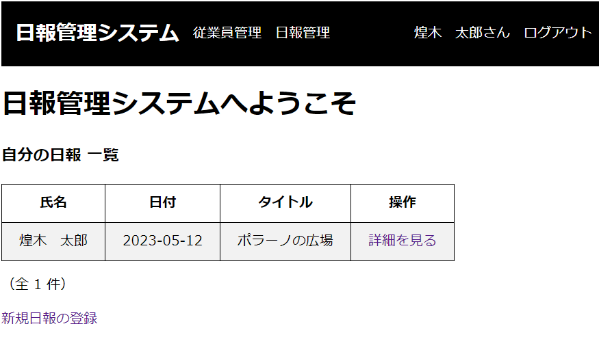

# DailyReportSystem

## 概要

プログラミングスクールの最終レッスンで作成したWebアプリケーションです。

従業員がログインをして日報の登録や閲覧を行なうシステムで、ログイン後、自分の日報の登録や更新に加え、他の従業員が登録した日報を閲覧できます。

アプリの上部にメニューを表示し、そこから各管理機能への遷移やログアウトを行ないます。

## 依存関係

Spring Bootバージョン：2.7.10
- 開発者ツール > Spring Boot DevTools, Lombok
- SQL > Spring Data JPA, MySQL Driver
- テンプレート・エンジン > Thymeleaf
- Web > Spring Web

## 機能

### 従業員管理機能

従業員情報を管理することができます。
以下の操作が可能です：

- 従業員情報の一覧表示
- 選択した従業員情報の詳細表示
- 新規登録（管理者のみ）
- 編集（管理者のみ）
- 論理削除（管理者のみ）

従業員情報は以下の内容を持ちます：

- 氏名
- 登録日時
- 更新日時
- 論理削除のフラグ
- 認証に関する情報
    - 社員番号
    - パスワード
    - 権限（一般または管理者）

### 日報管理機能

日報を管理することができます。
以下の操作が可能です：

- 複数の日報情報の一覧表示
- 1件の日報の詳細表示
- 新規登録
- 編集（※自分が登録した日報のみ）

日報情報は以下の内容を持ちます：

- タイトル
- 内容
- 日報作成者
- 日報の日付

### ログイン機能

登録した従業員の「社員番号」と「パスワード」を使ってログインできます。
デフォルトの従業員として
社員番号：ktaro, パスワード：ktaro（管理者）
社員番号：ttaro, パスワード：ttaro（一般）
が設定されています。

### ログイン後のトップページ表示

ログインした従業員が作成した日報のみを一覧表示します。

