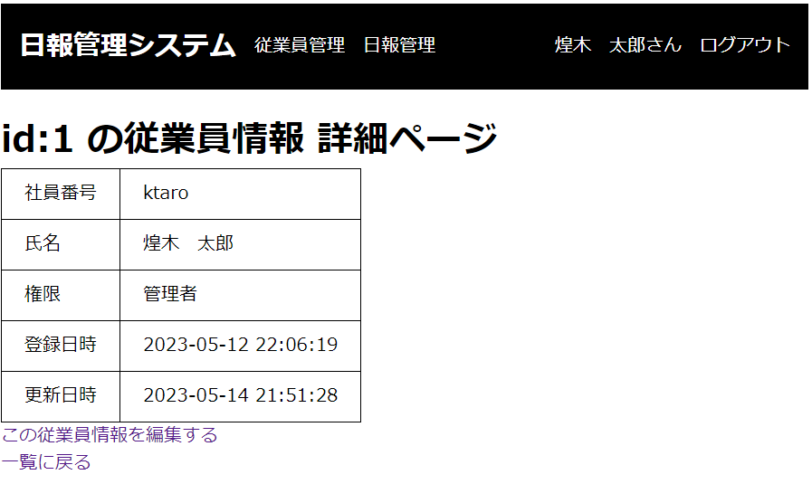
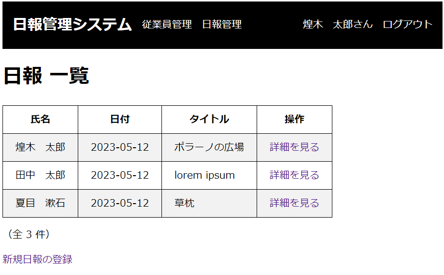

# DailyReportSystem

## 概要

プログラミングスクールの最終レッスンで作成したWebアプリケーションです。

従業員がログインをして日報の登録や閲覧を行なうシステムで、ログイン後、自分の日報の登録や更新に加え、他の従業員が登録した日報を閲覧できます。

アプリの上部にメニューを表示し、そこから各管理機能への遷移やログアウトを行ないます。

## 技術要素

Java / HTML / CSS / GitHub

Spring Tool Suite 4 / Spring Bootバージョン：2.7.10
- 開発者ツール > Spring Boot DevTools, Lombok
- SQL > Spring Data JPA, MySQL Driver
- テンプレート・エンジン > Thymeleaf
- Web > Spring Web

Dockerfileもこちらのリポジトリにアップしています→[DailyReportContainer](https://github.com/yukogithub/DailyReportContainer)

## 機能

### ログイン機能

登録した従業員の「社員番号」と「パスワード」を使ってログインできます。 
デフォルトの従業員として 
- 社員番号：ktaro, パスワード：ktaro（管理者）
- 社員番号：ttaro, パスワード：ttaro（一般）

が設定されています。

### ログイン後のトップページ表示

ログインした従業員が作成した日報のみを一覧表示します。

### 従業員管理機能

従業員情報を管理することができます。
以下の操作が可能です：

- 従業員情報の一覧表示
- 選択した従業員情報の詳細表示
- 新規登録（管理者のみ）
- 編集（管理者のみ）
- 論理削除（管理者のみ）

従業員情報は以下の内容を持ちます：

- 氏名
- 登録日時
- 更新日時
- 論理削除のフラグ
- 認証に関する情報
    - 社員番号
    - パスワード
    - 権限（一般または管理者）

### 日報管理機能

日報を管理することができます。
以下の操作が可能です：

- 複数の日報情報の一覧表示
- 1件の日報の詳細表示
- 新規登録
- 編集（※自分が登録した日報のみ）

日報情報は以下の内容を持ちます：

- タイトル
- 内容
- 日報作成者
- 日報の日付

## 所感

なかなか思うような結果が出せず、スクールの期限内に終わらないのではないかと焦った時期もありましたが、メンターの方々（とChatGPT）に助けていただきながらなんとか合格までたどり着くことができました。 
カリキュラムとしては合格しましたが、コードもアプリの機能面もまだまだ改善の余地があると感じていますので、引き続き学んでいきたいと思います。